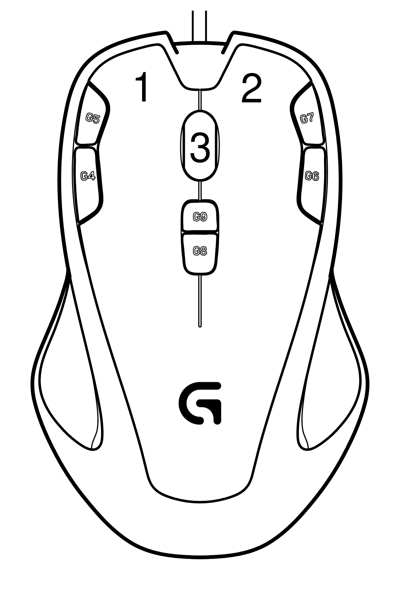

= Logitech G300s setup

The software for the Logitech G300s is what people might call sub-optimal to phrase it kindly.
Adding to the pain I couldn't get the Logitech software to detect my mouse on Mac and on Win10 it doesn't look better.
Unfortunately there is not much choice when looking for an ambidextrous mouse with more than 3 buttons (there seems to be even less choice for left-handed mouses with more than 3 buttons).
Fortunately there is this fantastic project named https://github.com/krayon/ratslap[ratslap] which allows configuring all the buttons in any way one would want, as long its HID compliant.
Combos, eg. `a` + `b` + `c`, are not supported, but that seems to be a restriction of the hardware, not the project.

What might be interesting is that one can combine modifiers on the mouse with keys on the keyboard or the mouse and vice versa.
For instance changing one button to `Ctrl` and holding it while using the mouse wheel to change the font size / zoom factor.
Or one button could be set to `Super` and while holding it one could use the cursor keys to change the desktop / windows placement.

== G300s button layout

== Prerequisites

Changing the mouse configuration is CLI based and requires `root` or at least `sudo` permissions to execute the binary.

== Default mapping

Resets all the button mappings and sets up some defaults.
Most OS won't do anything with buttons higher than Button3.
But at least these could be remappd using software such as https://karabiner-elements.pqrs.org/[Karabiner] (MacOs), https://www.autohotkey.com/[AutoHotKey] (Windows).
On Linux the tool depends a bit on desktop environment used and if using X11 or Wayland...

Notable settings:

* DPI ist set to 1000
* Button8: Cycle through profiles

[source,bash]
----
for profile in F{3-5}; do \
    ratslap --modify "$profile" \
        --rate 1000 \
        --D1  250 \
        --D2  500 \
        --D3  750 \
        --D4 1000 \
        --default-dpi 4 \
        -1 Button1 \
        -2 Button2 \
        -3 Button3 \
        -4 Button6 \
        -5 Button7 \
        -6 Button8 \
        -7 Button9 \
        -8 ModeSwitch \
        -9 Button11
----

=== Colors

Setup colors, black is default, cyan will be used to indicate Mac mode, red is unused yet
[source,bash]
----
ratslap --modify F3 --color black
ratslap --modify F4 --color cyan
ratslap --modify F5 --color red
----

== Linux configuration

Configuration:

[%header,cols="^,^,^"]
|===
|Left|Middle|Right
|Button1: +
(`default`)
|Button3: +
(`default`)
|Button2: +
(`default`)

|Button5: +
`LeftAlt` + `Left` +
(_back_ in history)
|Button9: +
`LeftCtrl` + `LeftShift` + `t` +
(Reopen closed tab)
|Button7: +
`LeftAlt` + `Right` +
(_forward_ in history)

|Button4: +
`LeftCtrl`
|Button8: +
(`default`) +
(ModeSwitch)
|Button6: +
`Super_L` +
(Gnome will show the "Activities" view)
|===

[source,bash]
----
ratslap --modify F3 \
 -4 LeftCtrl \
 -5 LeftAlt+Left \
 -6 Super_L \
 -7 LeftAlt+Right \
 -9 LeftCtrl+LeftShift+t
----
